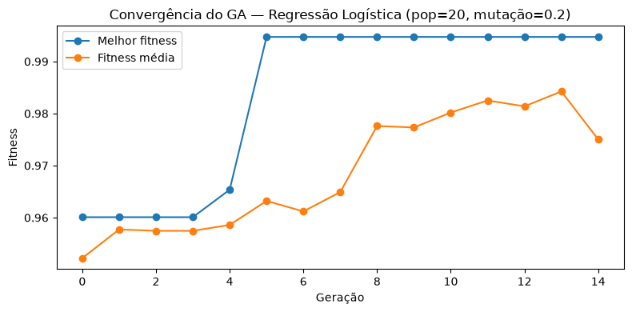
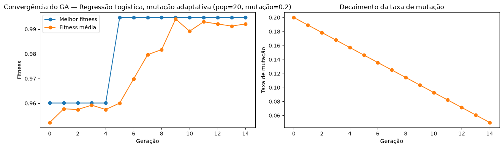
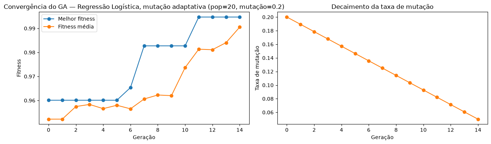
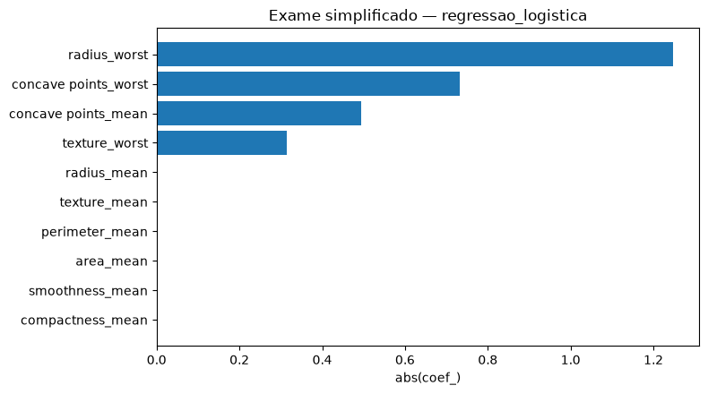

<div class="capa">
<div class="capa-topo">
<p class="capa-titulo">TECH CHALLENGE — FASE 2</p>
<p>IADT — Inteligência Artificial e Data Transformation</p>
<p><strong>Projeto 1</strong> — entrega da Fase 2 do Tech Challenge</p>
<p>Otimização de diagnóstico de câncer de mama com Algoritmo Genético e LLM</p>
<p>Saúde e segurança da mulher — Wisconsin Breast Cancer Dataset</p>
</div>
<div class="capa-participantes">
<p class="capa-participantes-titulo">Participantes</p>
<p>Ana Clara Gouvêa Poubel</p>
<p>Rafael Evangelista da Silva</p>
<p>Samir Iago Souza Góes</p>
<p>Diego Justino Amaral de Souza</p>
</div>
<div class="capa-rodape">
<p>Data: 01/09/2026</p>
<p>Repositório Git: https://github.com/SamirGoes/tech-challenge-fiap-fase2</p>
</div>
</div>

Este relatório descreve o **Projeto 1**, utilizado como entrega da **Fase 2** do Tech Challenge. O trabalho parte do notebook `notebooks/GA_HyperparametersOptimization.ipynb`. O ponto de partida é o modelo de Regressão Logística já treinado no dataset Wisconsin Breast Cancer (classificar tumor em maligno ou benigno).

---

## 1. O problema e o objetivo

O modelo classifica o tumor como **maligno** ou **benigno** com 30 medidas do núcleo celular. Na etapa anterior os hiperparâmetros foram escolhidos na mão / no padrão do scikit-learn.

Nesta fase o recorte é outro:

1. **Otimizar** os hiperparâmetros da **Regressão Logística** com um Algoritmo Genético escrito do zero (`src/ga_utils.py`).
2. **Comparar 3 configurações do GA** (mutação fixa, mutação adaptativa, mutação adaptativa + roleta) no mesmo holdout de teste.
3. **Explicar o resultado em português**, com o Claude, para um profissional de saúde — sem jargão de machine learning (`src/llm_utils.py`).
4. **Expor o modelo** numa API (FastAPI) e num front (Angular), com um **exame simplificado** de 10 medidas.

O dataset continua o mesmo: `data/data.csv` (569 amostras, 30 features + diagnóstico). Treino: 455 linhas. Teste: 114 linhas (20%, `random_state=42`). **O teste nunca entra na busca do GA** — só na avaliação final.

---

## 2. O que é o Algoritmo Genético neste projeto

Em vez de testar hiperparâmetros um a um, o GA mantém uma **população** de configurações e as faz evoluir:

| Ideia | No nosso código |
|---|---|
| Indivíduo | um dicionário com `C`, `penalty` e `class_weight` |
| Fitness | `0,5 · recall + 0,3 · F1 + 0,2 · accuracy` (validação cruzada 5-fold **só no treino**) |
| Seleção | torneio (k=3) ou roleta |
| Crossover | uniforme: cada gene vem de um dos pais |
| Mutação | reamostra o gene; pode ser taxa fixa ou decaindo ao longo das gerações |
| Elitismo | os 2 melhores passam intactos |

O **recall pesa mais** porque, em câncer, classificar um maligno como benigno (falso negativo) é o erro mais grave.

O loop de gerações é uma função só: `ga_utils.rodar_ga(...)`. Cada experimento no notebook só muda população, mutação e tipo de seleção.

Espaço de busca da Regressão Logística:

| Gene | Valores |
|---|---|
| `C` | contínuo, de 0,01 a 10 |
| `penalty` | `l1` ou `l2` |
| `class_weight` | `None` ou `balanced` |

---

## 3. Os 3 experimentos

Todos na Regressão Logística, população **20**, **15 gerações**, `seed=42`.

| Experimento | O que muda | Hiperparâmetros encontrados |
|---|---|---|
| 1 — padrão | Torneio + mutação **fixa 20%** | `C ≈ 0,037`, `penalty=l1`, `class_weight=balanced` |
| 2 — mutação adaptativa | Torneio + mutação **20% → 5%** | mesmo indivíduo (`C ≈ 0,037`, `l1`, `balanced`) |
| 3 — adaptativa + roleta | Roleta + mutação **20% → 5%** | mesmo indivíduo (`C ≈ 0,037`, `l1`, `balanced`) |

As curvas abaixo saem do notebook. Em todas, o melhor fitness sobe cedo (por volta da geração 5) e o elitismo segura esse valor até o fim.

**Experimento 1 — torneio + mutação fixa 20%**



A linha azul (melhor) chega perto de 0,995 e fica estável. A laranja (média da população) sobe com mais oscilação — a mutação fixa continua mexendo nos indivíduos.

**Experimento 2 — torneio + mutação 20% → 5%**



Mesmo salto na fitness. O gráfico da direita mostra a taxa de mutação caindo em linha reta, de 20% para 5%.

**Experimento 3 — roleta + mutação 20% → 5%**



A mutação decai igual ao Experimento 2. A seleção por roleta muda o caminho, mas o melhor indivíduo no fim foi o mesmo.

Na última execução, as três buscas chegaram no **mesmo indivíduo**. Isso não é “erro”: com a mesma semente e um espaço pequeno, o GA encontra uma região boa cedo e o elitismo a preserva.

---

## 4. Resultado: original vs. otimizado

Holdout de teste (114 amostras, nunca visto pelo GA). Números do notebook:

| Versão | Accuracy | Precision | Recall | F1 |
|---|---|---|---|---|
| Original (padrão sklearn) | 0,9737 | 0,9756 | 0,9524 | 0,9639 |
| **Experimento 1 — GA (mutação fixa)** | **0,9912** | **0,9767** | **1,0000** | **0,9882** |
| Experimento 2 — mutação adaptativa | 0,9912 | 0,9767 | 1,0000 | 0,9882 |
| Experimento 3 — adaptativa + roleta | 0,9912 | 0,9767 | 1,0000 | 0,9882 |

**Leitura simples**

- O GA **melhorou** o baseline: recall de 95,2% para **100%** e acurácia de 97,4% para **99,1%**.
- As três variações empataram no teste porque acharam a mesma configuração.
- Nenhuma versão piorou o original.
- O modelo escolhido para LLM, API e front é o da **Regressão Logística otimizada (Experimento 1)**.

Tabela salva em `experiments/results/comparison_table.csv`.

---

## 5. Feature importances — exame simplificado

O exame original pede **30 números** do núcleo da célula (tamanho, textura, contorno etc.). Preencher tudo isso na prática é trabalhoso. Depois de treinar o modelo, a pergunta é outra: **quais medidas ele realmente usou** para dizer se o tumor é maligno ou benigno?

O gráfico abaixo é essa resposta. Quatro medidas concentraram quase toda a decisão:

- o **tamanho máximo** do núcleo (`radius_worst`)
- o quão **irregular** é o contorno (`concave points_worst` e `concave points_mean`)
- a **textura** (`texture_worst`)

As outras entram na lista das 10, mas neste modelo quase não pesaram. Com só essas 10 medidas o teste ficou no **mesmo patamar** do exame completo: **99% de acerto** e **nenhum caso maligno classificado como benigno**. Por isso a aplicação pede o exame simplificado, e não as 30 colunas.



A lista das 10 **não fica fixa no formulário**. Ela sai do ranking do modelo. Se o notebook rodar de novo e a ordem mudar, a tela acompanha.

---

## 6. Interpretação com LLM

O modelo devolve só um rótulo (**maligno** ou **benigno**) e uma porcentagem. Isso não ajuda o profissional de saúde a entender o caso.

Pedimos então ao **Claude** para escrever um texto curto em português, no tom de um laudo de triagem. Regras simples:

- ele **não diagnostica** — só explica o que o modelo já calculou
- se o resultado for **positivo**, fala a chance de ser **maligno**; se for **negativo**, fala a chance de ser **benigno** (não o “resto” da porcentagem)
- quando os números vieram altos, cita tamanho, textura e contorno
- fecha avisando que **não substitui** o diagnóstico médico

Não existe nota automática do tipo “o laudo tirou 9”. A avaliação é ler e conferir: o texto bate com o número do modelo? inventou algum exame? usou jargão de machine learning? Se escapar, ajustamos o pedido feito ao Claude.

Exemplo no teste (caso maligno): o texto saiu **positivo**, **99% de chance de ser maligno**, citou o raio grande e os pontos côncavos do contorno, e fechou dizendo que é triagem.

---

## 7. API e front-end

O notebook exporta o modelo e o ranking. A API **carrega o que já foi treinado** — não treina de novo a cada requisição.

Rotas que o front usa:

| Endpoint | Função |
|---|---|
| `GET /predict/simplificado/features` | lista as 10 medidas do JSON |
| `POST /predict/simplificado` | classifica 1 exame e devolve o laudo |
| `POST /predict/lote/simplificado` | mesmo fluxo para um CSV |

Ainda existem `/predict` e `/predict/lote` com as 30 features; a tela atual mostra **só o simplificado**.

No laudo da interface, a barra usa a chance da classe prevista (`probabilidade`): caso negativo mostra, por exemplo, **78% de chance de ser benigno**, não os 22% de maligno.

Como rodar localmente:

```bash
python -m uvicorn api.main:app --reload
# http://127.0.0.1:8000/docs

cd frontend
npm start
# http://localhost:4200
```

A chave do Claude fica no `.env` (`ANTHROPIC_API_KEY`). Sem ela o modelo classifica; o laudo não é gerado.

---

## 8. Nuvem (item extra)

O modelo otimizado foi empacotado para AWS, com infraestrutura em Terraform (`terraform/`):

- **Lambda** (imagem Docker) + autoscaling  
- **Function URL** como HTTPS público  
- **SSM Parameter Store** para a chave da Anthropic  
- **CloudWatch Logs**

Detalhes em [docs/ARCHITECTURE.md](docs/ARCHITECTURE.md) e [terraform/README.md](terraform/README.md). A API foi validada localmente com `uvicorn`.

---

## 9. Desafios e o que aprendemos

- **Não vazar o teste no fitness.** Uma versão antiga avaliava o indivíduo direto no `X_test`. Isso inflaria o resultado. Corrigimos para `StratifiedKFold` só no treino.
- **Holdout pequeno (114 linhas).** Um acerto a mais ou a menos já mexe quase 1 ponto percentual. Por isso duas buscas “quase iguais” podem empatar no teste — e, nesta execução, as três acharam o mesmo indivíduo.
- **LLM copiar o número errado.** O prompt antigo pedia sempre “chance de ser maligno”. No caso benigno a barra mostrava 22%. Ajustamos para falar a chance da **classe prevista**.
- **Lista do exame simplificado viva.** Se a lista ficasse hardcoded no Angular, o front desencontraria do notebook. O ranking sai do JSON.

---

## 10. Conclusão

O GA melhorou a Regressão Logística no holdout (recall 95,2% → 100%). As três configurações de operadores, nesta semente, chegaram na mesma solução. O modelo aponta as 10 medidas que mais pesaram; a API e o front montam o exame simplificado a partir desse arquivo. A LLM só explica, em português, o que o modelo já decidiu. É **triagem automática** — não substitui diagnóstico médico.

Encadeamento: **GA escolhe o modelo → o modelo aponta as 10 medidas → JSON alimenta API e front → Claude escreve o laudo.**

---

## 11. Entregáveis

| Item | Local / observação |
|---|---|
| Repositório Git | https://github.com/SamirGoes/tech-challenge-fiap-fase2 |
| Notebook | https://github.com/SamirGoes/tech-challenge-fiap-fase2/blob/main/notebooks/GA_HyperparametersOptimization.ipynb |
| Aplicação (AWS) | [Triagem de câncer de mama](https://d3u4nxzfcqh14d.cloudfront.net)|
| Vídeo (até 15 min) | https://youtu.be/B7IVvdhWeQM |

Como executar: `git clone` do repositório → `pip install -r requirements.txt` → `jupyter notebook notebooks/GA_HyperparametersOptimization.ipynb`
