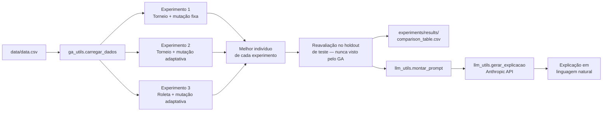
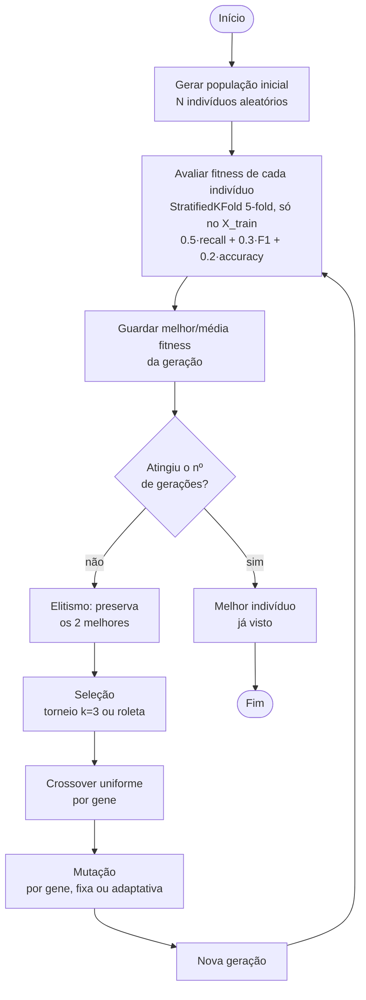
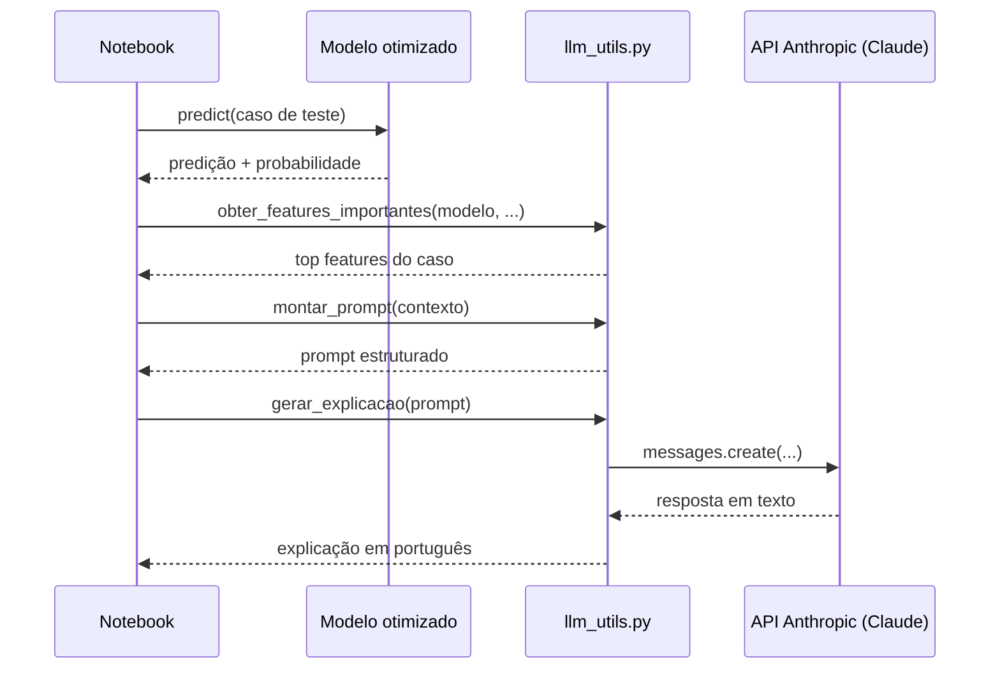
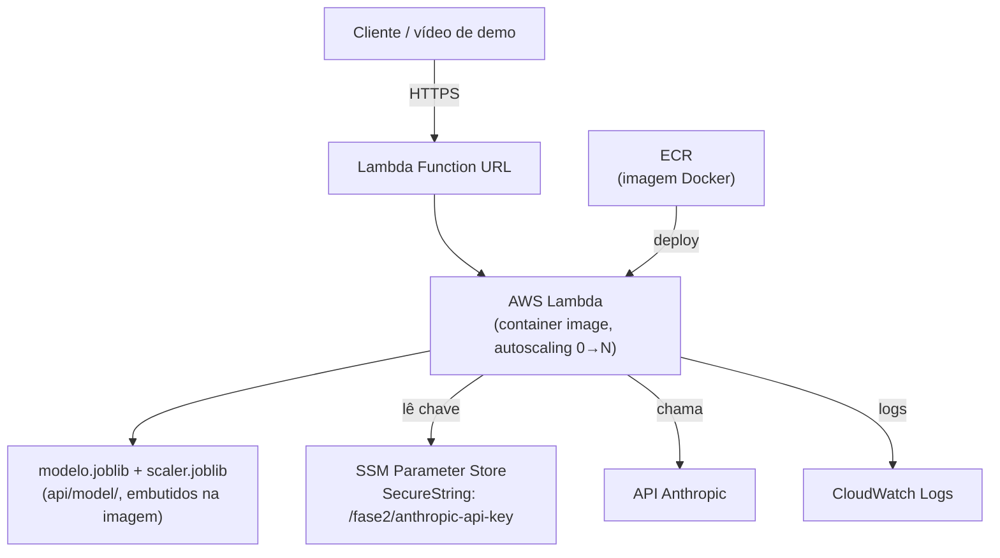

# Arquitetura — Fase 2 (GA + LLM)

Este documento descreve como as peças da Fase 2 se encaixam: o dataset e o modelo de diagnóstico (Regressão Logística, herdado da Fase 1), o Algoritmo Genético que otimiza seus hiperparâmetros com 3 configurações de operadores diferentes, e a integração com a LLM (Claude) que traduz predições em explicações para profissionais de saúde.

## Visão geral

## Fluxo do Algoritmo Genético

O notebook `GA_HyperparametersOptimization.ipynb` roda esse fluxo **3 vezes**, sempre na Regressão Logística, cada vez com uma configuração diferente de operadores: Experimento 1 (seleção por torneio + mutação fixa), Experimento 2 (torneio + mutação adaptativa) e Experimento 3 (roleta + mutação adaptativa). O loop de gerações é um único "motor" — `ga_utils.rodar_ga(algoritmo, ...)` — que cada célula de experimento chama passando o algoritmo e os parâmetros do GA; internamente ele despacha para as funções de apoio (`criar_individuo_*`, `mutar_*`, `fitness_*`) do algoritmo escolhido.

O `X_test` (holdout) **não aparece nesse fluxo** — ele só é usado uma vez, depois do GA terminar, para avaliar o indivíduo vencedor (ver `RELATORIO_TECNICO.md`, seção 2.3, sobre por que isso importa).

## Sequência da interpretação via LLM

## Por que cada algoritmo tem seu próprio código de GA

`ga_utils.py` **não** tem uma abstração única de "espaço de genes" compartilhada entre os 3 algoritmos — cada um tem sua função `criar_individuo_*` e `mutar_*` própria, porque os hiperparâmetros de Random Forest, Regressão Logística e Regressão Linear são bem diferentes entre si (categóricos vs. contínuos, ranges diferentes, e no caso da Regressão Linear um gene extra que nem é hiperparâmetro do sklearn — o `threshold`). O que é genuinamente igual entre os três — `crossover`, `selecao_torneio`, `selecao_roleta` — é compartilhado, porque essas funções não precisam saber o que cada gene significa. `rodar_ga` amarra tudo: recebe o nome do algoritmo e despacha para o `criar_individuo_*`/`fitness_*`/`mutar_*` certo via os dicts `CRIAR_INDIVIDUO`/`FITNESS`/`MUTAR`.

## Módulos

| Arquivo | Responsabilidade |
|---|---|
| `src/ga_utils.py` | `carregar_dados` (mesmo pré-processamento do notebook 01); `criar_individuo_*`/`mutar_*`/`fitness_*`/`construir_*` para cada um dos 3 algoritmos; `crossover`, `selecao_torneio`, `selecao_roleta` compartilhados; `rodar_ga` (motor do GA, genérico por algoritmo); `calcular_metricas` |
| `src/llm_utils.py` | `SYSTEM_PROMPT`; `obter_features_importantes` (explicabilidade); `formatar_contexto_ga`; `montar_prompt`; `gerar_explicacao` (API Anthropic, com system prompt) |
| `notebooks/GA_HyperparametersOptimization.ipynb` | Orquestra tudo: carrega os dados, roda os 3 experimentos via `ga_utils.rodar_ga`, compara com o baseline, gera as explicações via LLM |

## Implementação em nuvem (opcional, item de pontuação extra)

O item opcional do enunciado ("escalabilidade automática para lidar com variações de demanda") foi implementado expondo o melhor modelo otimizado (Regressão Logística, ver `RELATORIO_TECNICO.md`) como uma API na AWS.

### Por que essa stack

| Componente | Papel | Por quê |
|---|---|---|
| **AWS Lambda** (container image) | Roda a API (FastAPI via adaptador Mangum), escala de 0 a N instâncias por carga | Nível gratuito **permanente** (1M requisições + 400.000 GB-segundos/mês); é o recurso que satisfaz "escalabilidade automática" do enunciado |
| **Lambda Function URL** | Endpoint HTTPS público | Não precisa de API Gateway — gratuito, direto no Lambda |
| **SSM Parameter Store** (`SecureString`) | Guarda `ANTHROPIC_API_KEY` fora do código/imagem | Gratuito, ao contrário do Secrets Manager (~US$0,40/segredo/mês) |
| **ECR** | Armazena a imagem Docker versionada | Pré-requisito do Lambda em modo container |
| **CloudWatch Logs** | Logs automáticos de cada requisição | Satisfaz "monitoramento e logging adequados"; 5GB/mês grátis |
| **Terraform** (`terraform/`) | Declara toda a infraestrutura acima como código | "Infraestrutura como código" pedido no enunciado |

### Fluxo de uma requisição

1. Cliente faz `POST /predict` com os dados do paciente (30 features).
2. A Lambda já está com o modelo carregado em memória (`api/model/*.joblib`) — não treina nada em runtime.
3. O modelo prevê benigno/maligno, a chance de ter a doença (`chance_doenca` = P(maligno)) e se o resultado é positivo ou negativo.
4. `llm_utils.montar_prompt` injeta esses dados + o contexto do GA; `llm_utils.gerar_explicacao` chama a API Anthropic com o system prompt (chave lida do `.env` local, ou do SSM na AWS).
5. Resposta: `{"predicao": ..., "resultado": "positivo"|"negativo", "tem_doenca": ..., "chance_doenca": ..., "probabilidade": ..., "explicacao": ...}`.

### Controle de custo

- `reserved_concurrent_executions = 5` (variável `concorrencia_maxima` no Terraform) — limita o teto de instâncias simultâneas, evitando custo surpresa.
- Modelo Claude Haiku (padrão em `llm_utils.py`) — o mais barato da linha Anthropic.
- Tudo dentro do nível gratuito da AWS para o volume esperado de uma demonstração acadêmica.

Passos de deploy detalhados: [`terraform/README.md`](../terraform/README.md).
