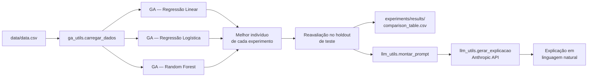
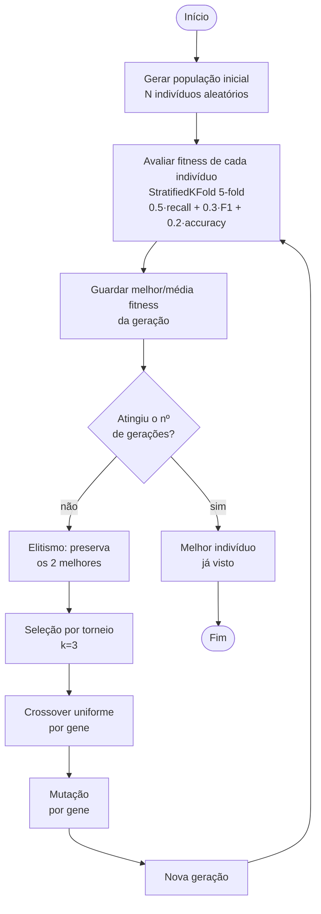
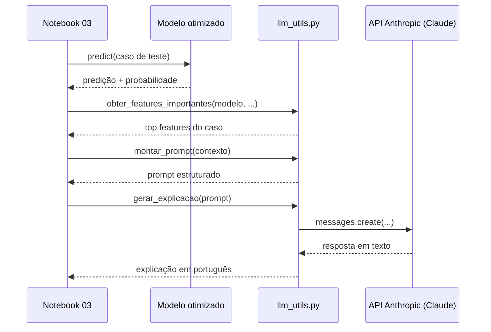

# Arquitetura — Fase 2 (GA + LLM)

Este documento descreve como as peças da Fase 2 se encaixam: o dataset e os 3 modelos de diagnóstico (herdados da Fase 1), o Algoritmo Genético que otimiza os hiperparâmetros de cada um, e a integração com a LLM (Claude) que traduz predições em explicações para profissionais de saúde.

## Visão geral

## Fluxo do Algoritmo Genético

O notebook `03_ga_llm_breast_cancer.ipynb` roda esse fluxo **uma vez por algoritmo** (3 experimentos, cada um com sua própria população/mutação/nº de gerações). O loop de gerações fica escrito direto na célula do notebook — não existe um "motor" único escondido num módulo separado, só as funções de apoio (`criar_individuo_*`, `mutar_*`, `fitness_*`, `crossover`, `selecao_torneio`) vêm de `src/ga_utils.py`.

## Sequência da interpretação via LLM

## Por que cada algoritmo tem seu próprio código de GA

`ga_utils.py` **não** tem uma abstração única de "espaço de genes" compartilhada entre os 3 algoritmos — cada um tem sua função `criar_individuo_*` e `mutar_*` própria, porque os hiperparâmetros de Random Forest, Regressão Logística e Regressão Linear são bem diferentes entre si (categóricos vs. contínuos, ranges diferentes, e no caso da Regressão Linear um gene extra que nem é hiperparâmetro do sklearn — o `threshold`). Só o que é genuinamente igual entre os três — `crossover` (troca chaves de um dict) e `selecao_torneio` (compara uma lista de fitness) — é compartilhado, porque essas duas funções não precisam saber o que cada gene significa.

## Módulos

| Arquivo | Responsabilidade |
|---|---|
| `src/ga_utils.py` | `carregar_dados` (mesmo pré-processamento do notebook 01); `criar_individuo_*`/`mutar_*`/`fitness_*`/`construir_*` para cada um dos 3 algoritmos; `crossover` e `selecao_torneio` compartilhados; `calcular_metricas` |
| `src/llm_utils.py` | `obter_features_importantes` (feature_importances_ ou coef_); `montar_prompt`; `gerar_explicacao` (chama a API Anthropic) |
| `notebooks/03_ga_llm_breast_cancer.ipynb` | Orquestra tudo: carrega os dados, roda os 3 experimentos (loop de gerações visível na célula), compara com o baseline, gera as explicações via LLM |
